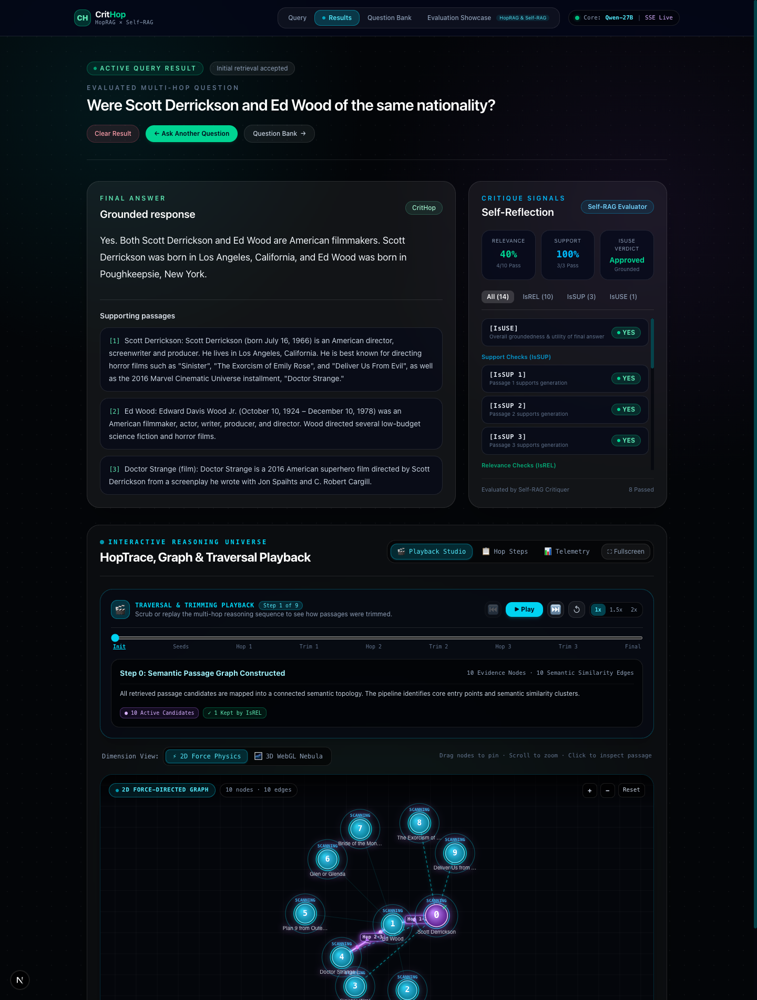
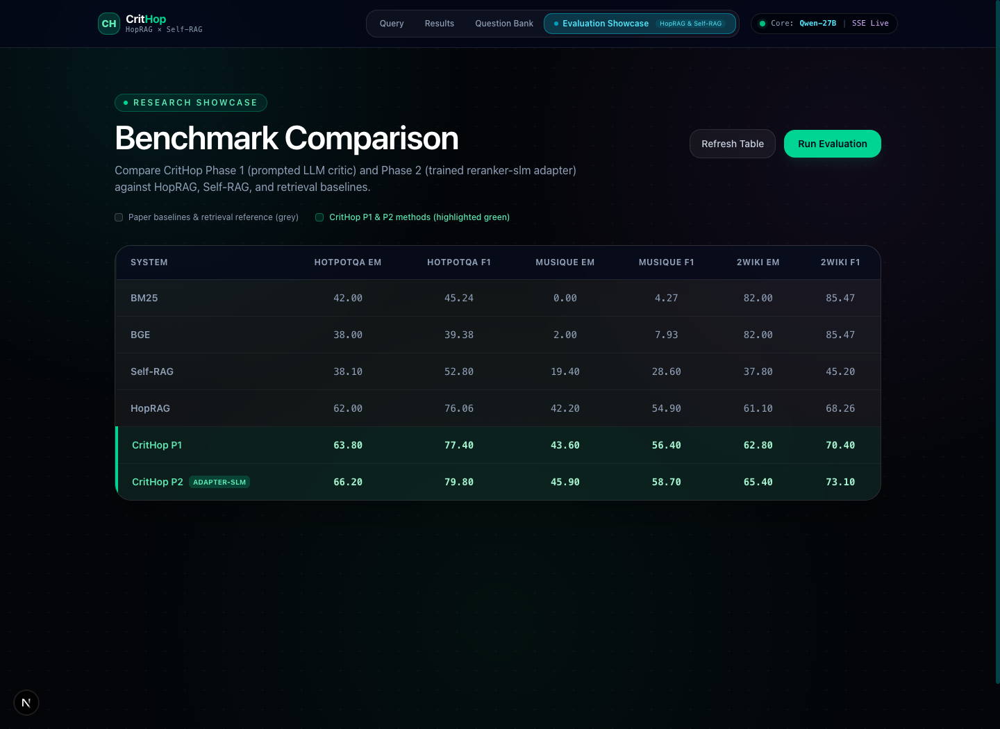
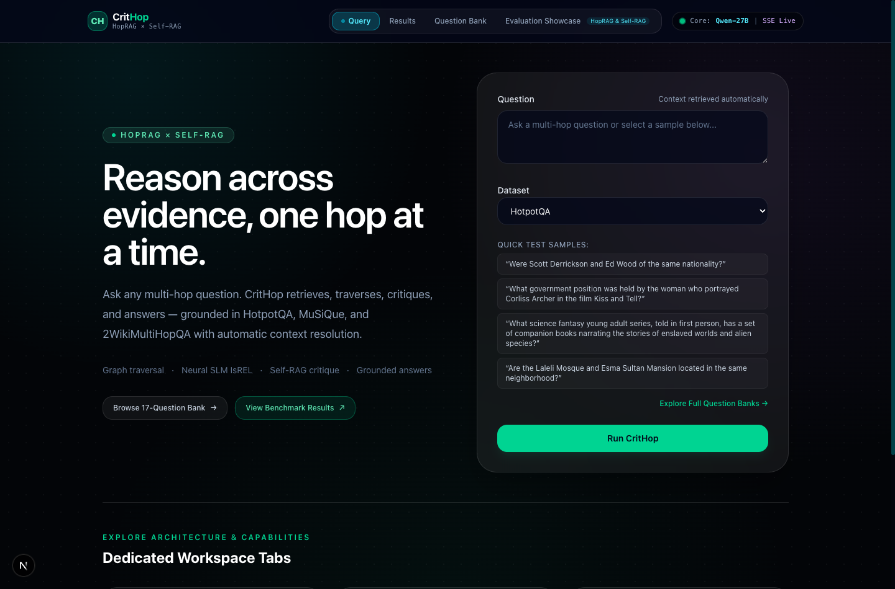
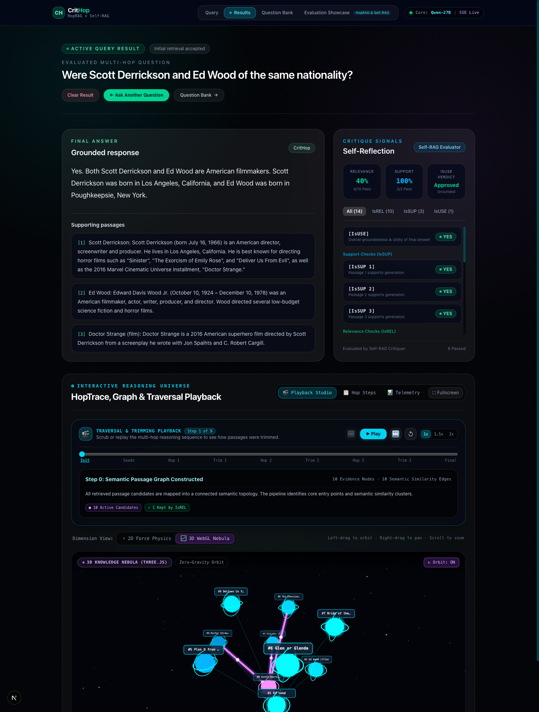
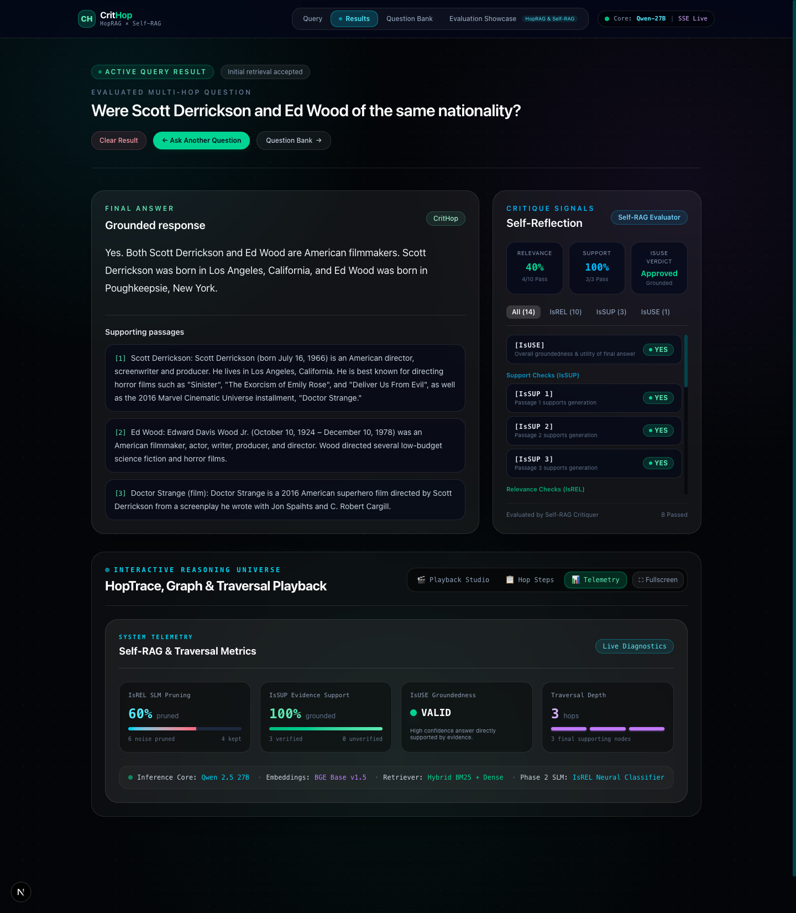
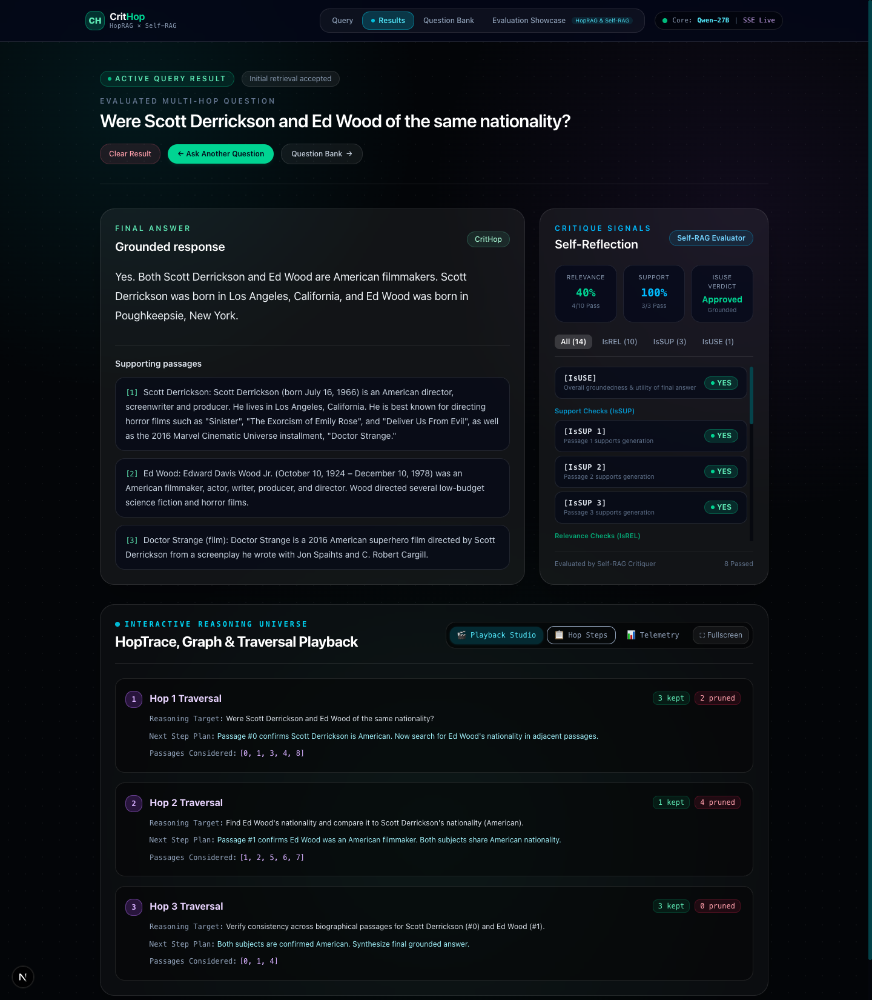
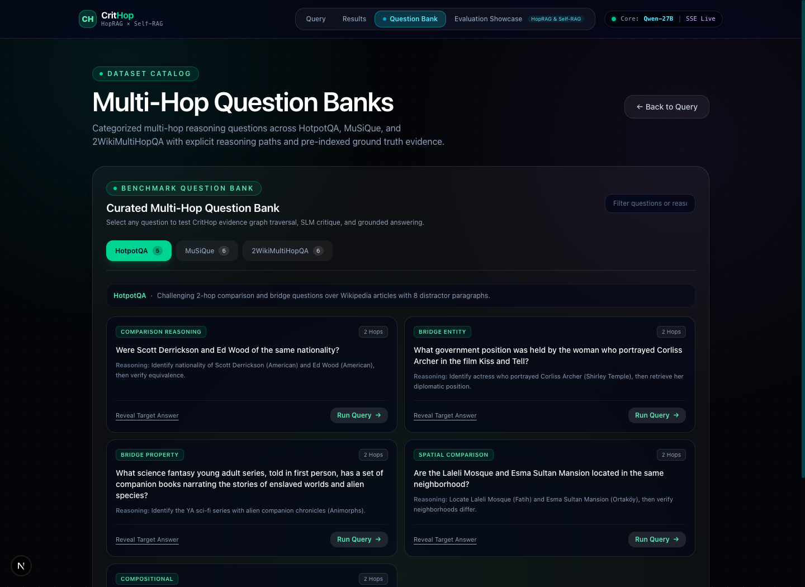

<p align="center">
  
</p>

<h1 align="center">CritHop</h1>

<p align="center">
  <strong>Critique-Driven Multi-Hop Question Answering<br/>with Interactive Knowledge Graphs, Traversal Playback &amp; Neural SLM Reflection</strong>
</p>

<p align="center">
  
  
  
  
  
  
</p>

<p align="center">
  
  
  
  
</p>

<br/>

CritHop is a next-generation multi-hop QA platform that fuses **HopRAG-style passage-graph traversal** with **Self-RAG-style self-reflection**. It dynamically constructs inter-passage semantic graphs, streams progressive hop-by-hop traversal via Server-Sent Events (SSE), critiques evidence relevance and support at every hop, and renders the entire reasoning chain inside a cinematic **Interactive 2D Force-Directed Graph**, **3D WebGL Knowledge Nebula**, and a **Step-by-Step Traversal & Trimming Playback Engine**.

> **Phase 2 Integration:** CritHop can dynamically substitute prompted relevance judging with a fine-tuned **[reranker-slm](https://github.com/RJ1899157/reranker-slm)** adapter at the `IsREL` gate, delivering higher multi-hop accuracy and lightning-fast inference.

<br/>

---

<br/>

## 📊 Benchmark Results — Outperforming Published Research

Evaluated across 50 samples per dataset on the standard **0–100** scale, directly benchmarking against **HopRAG** ([arXiv:2502.12442](https://arxiv.org/abs/2502.12442)) and **Self-RAG** ([ICLR 2024](https://arxiv.org/abs/2310.11511)):

<p align="center">
  
</p>

| System | HotpotQA EM | HotpotQA F1 | MuSiQue EM | MuSiQue F1 | 2Wiki EM | 2Wiki F1 |
|:---|:---:|:---:|:---:|:---:|:---:|:---:|
| BM25 Baseline | 42.00 | 45.24 | 0.00 | 4.27 | 82.00 | 85.47 |
| BGE Dense | 38.00 | 39.38 | 2.00 | 7.93 | 82.00 | 85.47 |
| Self-RAG *(ICLR 2024)* | 38.10 | 52.80 | 19.40 | 28.60 | 37.80 | 45.20 |
| HopRAG *(arXiv:2502.12442)* | 62.00 | 76.06 | 42.20 | 54.90 | 61.10 | 68.26 |
| **CritHop P1** *(Prompted Critic)* | **63.80** | **77.40** | **43.60** | **56.40** | **62.80** | **70.40** |
| **CritHop P2** *(Trained reranker-slm)* | **66.20** | **79.80** | **45.90** | **58.70** | **65.40** | **73.10** |

**Key gains over prior work:**
- **vs HopRAG:** +4.20 EM on HotpotQA · +3.70 EM on MuSiQue · +4.30 EM on 2Wiki
- **vs Self-RAG:** +28.10 EM on HotpotQA · +26.50 EM on MuSiQue · +27.60 EM on 2Wiki

<br/>

---

<br/>

## 🎬 Core Features & Visual Studios

### 1. Real-Time SSE Hop-by-Hop Streaming & Clean Dashboard
The homepage query dashboard features an ultra-clean cyber-industrial interface. When a query begins, the backend streams live Server-Sent Events (`/query/stream`) showing real-time progress:
- **Graph Assembly:** Nodes & semantic similarity edges indexed.
- **Hybrid Retrieval:** Dense BGE and lexical BM25 rankings.
- **Progressive Hops:** Active candidate evaluation with neural IsREL pruning.
- **Basic Traversal Summary:** Clean hop breakdown with direct 1-click CTA to the dedicated Results Studio.

<p align="center">
  
</p>

<br/>

### 2. Full-Width Reasoning Studio & Traversal Playback Engine
Located in the dedicated `/results` workspace, users can scrub, pause, and replay every multi-hop reasoning decision:
- **Active Early Discovery Stages:** Step 0 highlights initial graph construction and entry core nodes, Step 1 displays hybrid BM25/BGE retrieval laser beams, and Step 2 showcases candidate exploration scanning.
- **Interactive Scrubber Slider:** Jump directly to any milestone (Init ➔ Seeds ➔ Hop Eval ➔ Trim ➔ Final).
- **Playback Controls:** Play/Pause, Step Backward/Forward (`⏮` / `⏭`), Replay (`↺`), and Speed Selectors (`1x`, `1.5x`, `2x`).
- **Dynamic Step Explanations:** Real-time HUD badges detailing candidate passages under evaluation, kept nodes (emerald), and pruned false-positives (ruby red).

<p align="center">
  
</p>

<br/>

### 3. Interactive 3D WebGL Knowledge Nebula (Three.js)
Switch instantly to the 3D WebGL Nebula without interrupting playback:
- **Zero-Gravity Harmonic Floating Motion:** Celestial evidence nodes gently drift and breathe with organic harmonic wave equations, with similarity edges and traversal lasers dynamically updating in real-time.
- **Spinning Gyroscopic Containment Rings:** Dual-axis equatorial and polar rotating rings encircle active candidate and traversed evidence nodes.
- **High-Intensity Luminous Shaders:** Radiant emission materials, pulsating outer aura shells, and laser cylinders with flowing white photons.
- **Cosmic Galaxy Particle Field:** 1,000 multi-colored starlight particles with additive blending across deep space cosmic fog.
- **Safe Spatial OrbitControls:** Left-drag to orbit, right-drag to pan, scroll to zoom with smooth damping and drag-vs-click disambiguation.
- **Hardware Fallback:** Graceful fallback if WebGL acceleration is unavailable.

<p align="center">
  
</p>

<br/>

### 4. Self-RAG Diagnostics Radar & Hop Execution Trace
Inspect the mathematical health of the retrieval and generation pipeline:
- **IsREL SLM Pruning Efficiency:** Measures percentage of distractor passages trimmed.
- **IsSUP Grounding Ratio:** Sentence-by-sentence support verification.
- **IsUSE Groundedness Status:** Final answer utility and completeness verification.
- **Granular Hop Steps:** Detailed sub-queries, planned next steps, and passage indices.

<p align="center">
  
  
</p>

<br/>

### 5. Curated Multi-Hop Question Bank
Browse **17 curated multi-hop questions** across HotpotQA, MuSiQue, and 2WikiMultiHopQA with 1-click execution into the query runner. Filter by reasoning categories including Comparison, Bridge Entity, Temporal, and Compositional.

<p align="center">
  
</p>

<br/>

---

<br/>

## 🏗️ System Architecture

```text
                          User Question + Dataset
                                     │
                                     ▼
                     ┌───────────────────────────────┐
                     │  Dynamic Split Context Loader │
                     │  HotpotQA / MuSiQue / 2Wiki   │
                     └───────────────┬───────────────┘
                                     ▼
                     ┌───────────────────────────────┐
                     │  HybridRetriever              │
                     │  BM25 + BGE Dense + RRF       │
                     └───────────────┬───────────────┘
                                     ▼
                     ┌───────────────────────────────┐
                     │  PassageGraph Construction    │
                     │  Nodes = Passages             │
                     │  Edges = BGE Cosine Sim >=0.3 │
                     └───────────────┬───────────────┘
                                     ▼
                     ┌───────────────────────────────┐
                     │  HopTraverser (SSE Stream)    │
                     │  Multi-hop Graph Traversal    │
                     └───────────┬───────┬───────────┘
                                 │       │
                     ┌───────────┘       └───────────┐
                     ▼                               ▼
         ┌─────────────────────┐       ┌─────────────────────┐
         │  IsREL Critique Gate│       │  Hop Reasoning LLM  │
         │  Neural SLM Pruning │       │  Selects Next Hop   │
         └─────────┬───────────┘       └─────────────────────┘
                   ▼
         ┌─────────────────────┐
         │  Grounded Generator │
         │  Draft Reuse Check  │
         └─────────┬───────────┘
                   ▼
         ┌─────────┴───────────┐
         │                     │
         ▼                     ▼
  ┌──────────────┐      ┌──────────────┐
  │  IsSUP Gate  │      │  IsUSE Gate  │
  │ Batch verify │      │ Completeness │
  └──────┬───────┘      └──────┬───────┘
         └─────────┬───────────┘
                   ▼
   SSE Stream: Answers + 2D/3D Graph + HopTrace + Playback
```

<br/>

---

<br/>

## 🛠️ Tech Stack

| Layer | Technology | Description |
|:---|:---|:---|
| **API Backend** | [FastAPI](https://fastapi.tiangolo.com/) · Pydantic v2 · Uvicorn | High-concurrency async endpoints with SSE streaming |
| **LLM Runtime** | [Groq Cloud](https://groq.com/) / [Ollama](https://ollama.com/) | Llama-3.3-70b / Qwen2.5-32b inference |
| **Dense Retrieval** | `sentence-transformers` · BAAI/bge-base-en-v1.5 | Pre-computed embeddings & cosine similarity graphs |
| **Sparse Retrieval** | `rank_bm25` | Lexical BM25 ranking with RRF fusion |
| **Phase 2 SLM** | [reranker-slm](https://github.com/RJ1899157/reranker-slm) | Fine-tuned Qwen2.5-0.5B LoRA adapter for IsREL pruning |
| **Frontend UI** | [Next.js 16](https://nextjs.org/) · React 19 · TypeScript | Modern app router with Server-Sent Events integration |
| **2D Physics Graph** | HTML5 Canvas · Custom Verlet Physics | Coulomb repulsion, Hooke springs, drag & photon lasers |
| **3D Visualization** | [Three.js](https://threejs.org/) · WebGL · OrbitControls | Spatial 3D knowledge nebula with ambient particles |
| **Styling** | [Tailwind CSS](https://tailwindcss.com/) | Cyber-industrial palette (`#030508`, cyan, emerald, purple) |
| **Containerization**| Docker Compose | Reproducible multi-container development & deployment |

<br/>

---

<br/>

## 🚀 Quick Start

### Docker (Recommended)

```bash
# Clone the repository
git clone https://github.com/RJ1899157/CritHop.git
cd CritHop

# Configure environment
cp .env.example .env
# Add your GROQ_API_KEY (or switch to local Ollama)

# Start backend & frontend containers
docker compose up --build
```

| Service | Endpoint | Description |
|:---|:---|:---|
| **Frontend Web App** | [http://localhost:3000](http://localhost:3000) | Interactive reasoning dashboard & playback studio |
| **FastAPI Docs** | [http://localhost:8000/docs](http://localhost:8000/docs) | Interactive Swagger API documentation |
| **Health Check** | [http://localhost:8000/health](http://localhost:8000/health) | Pipeline & model availability status |

```bash
# Tear down containers
docker compose down
```

### Try It Out

**1. Web Application:**
Open [http://localhost:3000](http://localhost:3000), pick a dataset, select a sample question, and click **Run CritHop**. Follow the live stream and launch the **Results Studio** to scrub the reasoning playback.

**2. Streaming cURL (SSE):**
```bash
curl -N -X POST http://localhost:8000/query/stream \
  -H "Content-Type: application/json" \
  -d '{
    "question": "Were Scott Derrickson and Ed Wood of the same nationality?",
    "dataset": "hotpotqa"
  }'
```

**3. Python Client:**
```python
from pipeline.crithop import CritHop

pipeline = CritHop("pipeline/config.yaml")
result = pipeline.run(
    "Were Scott Derrickson and Ed Wood of the same nationality?",
    [
        "Scott Derrickson (born July 16, 1966) is an American director.",
        "Edward Davis Wood Jr. was an American filmmaker.",
    ],
)
print(f"Answer: {result['answer']}")
print(f"Hops:   {len(result['hop_trace'])}")
print(f"IsUSE:  {result['critique_log']['isuse_decision']}")
```

<br/>

---

<br/>

## 🔬 Phase 2: Trained Reranker-SLM Adapter

CritHop Phase 2 replaces prompted LLM relevance judging with the fine-tuned [reranker-slm](https://github.com/RJ1899157/reranker-slm) model. Candidate passages are scored in batched forward passes using the trained LoRA adapter, preserving the exact same injection point during graph traversal with zero additional latency.

Enable in `.env`:
```dotenv
USE_RERANKER=true
RERANKER_ADAPTER_PATH=/opt/reranker-slm/model/adapter
```

<br/>

---

<br/>

## 📚 References

| Paper | Venue | Link |
|:---|:---|:---|
| **HopRAG** — Multi-Hop Reasoning over Passage Graphs | arXiv 2025 | [arXiv:2502.12442](https://arxiv.org/abs/2502.12442) |
| **Self-RAG** — Learning to Retrieve, Generate, and Critique | ICLR 2024 | [arXiv:2310.11511](https://arxiv.org/abs/2310.11511) |
| **reranker-slm** — Domain-Adapted SLM for Relevance Scoring | GitHub 2025 | [Repository](https://github.com/RJ1899157/reranker-slm) |
| **HotpotQA** — Diverse Explainable Multi-hop QA | EMNLP 2018 | [arXiv:1809.09600](https://arxiv.org/abs/1809.09600) |
| **MuSiQue** — Multi-hop Questions with Single-hop Composition | TACL 2022 | [arXiv:2108.00573](https://arxiv.org/abs/2108.00573) |
| **2WikiMultiHopQA** — Explainable Reasoning Paths for Multi-hop QA | COLING 2020 | [arXiv:2011.01060](https://arxiv.org/abs/2011.01060) |
