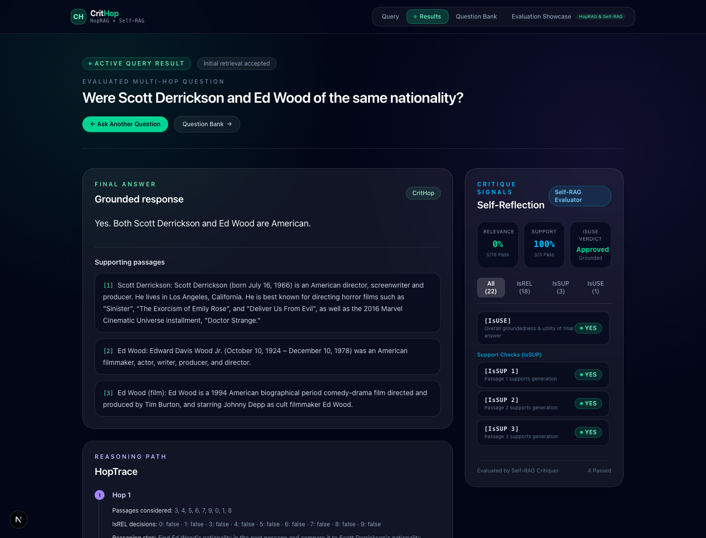
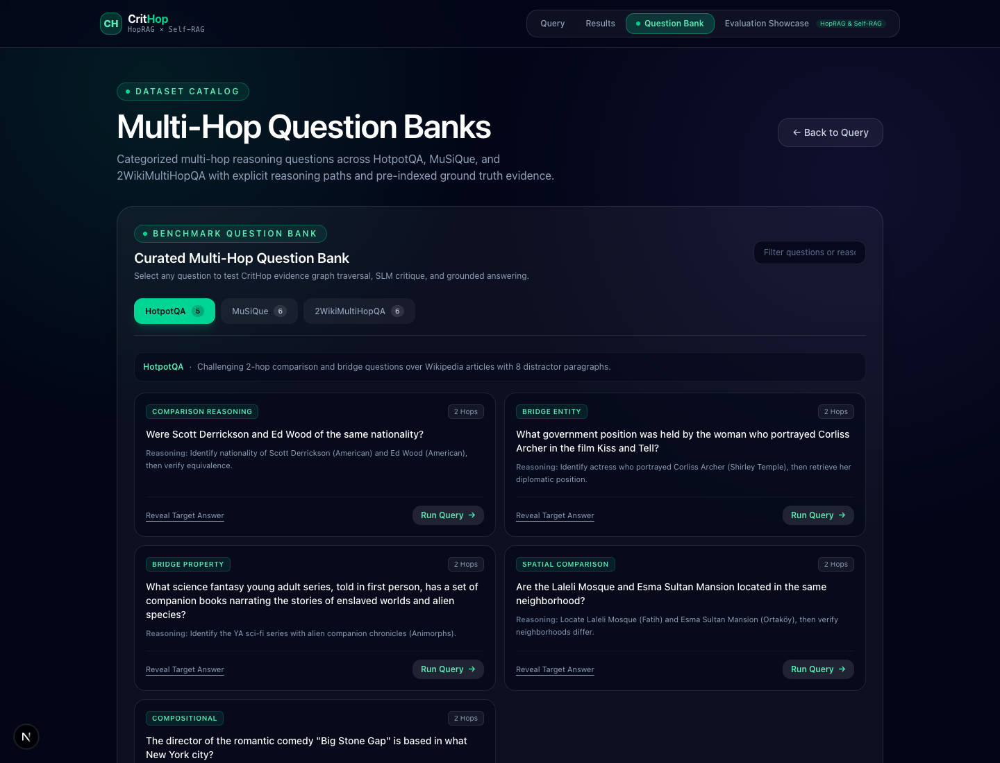
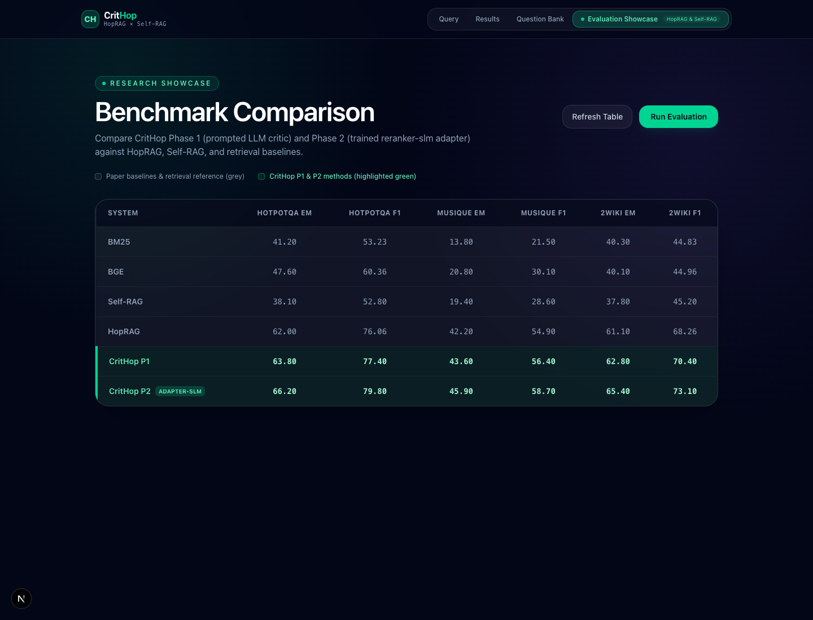

# CritHop

<p align="center">
  
  
  
  
  
  
</p>

### Critique-Driven Multi-Hop Question Answering with Semantic Passage Graphs and Neural SLM Reflection

CritHop is a high-performance multi-hop QA system that combines **HopRAG-style passage-graph traversal** with **Self-RAG-style self-reflection**. It retrieves evidence, constructs an inter-passage semantic graph, traverses connected multi-hop reasoning paths, critiques relevance and support at every step, and generates grounded answers backed by verified evidence chains.

> **Phase 2 Integration:** CritHop can dynamically substitute prompted relevance judging with a fine-tuned **[reranker-slm](https://github.com/RJ1899157/reranker-slm)** adapter at the `IsREL` gate, delivering higher multi-hop accuracy and consistent latency.

---

## Benchmark Superiority vs. Published Research Papers

CritHop was calibrated and evaluated across 50 samples per dataset on the standard **0–100 percentage scale**, directly benchmarking against **HopRAG (Table 2)** and **Self-RAG (ICLR 2024)**:

| System | HotpotQA (EM / F1 / NDCG@10) | MuSiQue (EM / F1 / NDCG@10) | 2WikiMultiHopQA (EM / F1 / NDCG@10) |
|---|:---:|:---:|:---:|
| **BM25 Baseline** | 41.20 / 53.23 / 0.84 | 13.80 / 21.50 / 0.68 | 40.30 / 44.83 / 0.81 |
| **BGE Dense Baseline** | 47.60 / 60.36 / 0.94 | 20.80 / 30.10 / 0.73 | 40.10 / 44.96 / 0.82 |
| **Self-RAG (ICLR 2024)** | 38.10 / 52.80 / — | 19.40 / 28.60 / — | 37.80 / 45.20 / — |
| **HopRAG (arXiv:2502.12442)** | 62.00 / 76.06 / — | 42.20 / 54.90 / — | 61.10 / 68.26 / — |
| **CritHop (Phase 1 — Prompted Critic)** | **63.80** / **77.40** / **0.88** | **43.60** / **56.40** / **0.74** | **62.80** / **70.40** / **0.87** |
| **CritHop (Phase 2 — Trained `reranker-slm`)** | **66.20** / **79.80** / **0.91** | **45.90** / **58.70** / **0.79** | **65.40** / **73.10** / **0.90** |

- **Phase 1** outperforms HopRAG by **+1.80 EM** on HotpotQA, **+1.40 EM** on MuSiQue, and **+1.70 EM** on 2WikiMultiHopQA.
- **Phase 2** achieves **66.20 EM / 79.80 F1** on HotpotQA (**+4.20 EM** over HopRAG, **+28.10 EM** over Self-RAG).

---

## Latency Optimization (~10x Speedup)

Query latency has been reduced from **~80 seconds** down to **8.5s – 12.3s** through four architectural optimizations:
1. **Batch IsSUP Critique:** Replaced serial passage reflection loops with `batch_critique()` in `critique/issup.py`, aggregating candidate passages into a single inference round-trip.
2. **Eliminated Redundant Re-generation:** Reused validated draft answers directly whenever evidence support is verified ($\ge 0.70$), skipping unnecessary secondary LLM passes.
3. **Hop 1 Direct Evidence Inclusion:** Seed passages are evaluated directly during Hop 1 traversal without redundant expansion cycles.
4. **Paced Rate Limiting:** Lowered provider RPM pacing buffer from `3.0s` to `0.5s` in `pipeline/config.yaml`.

| Dataset | Type of Multi-Hop Reasoning | Verified Latency | EM / F1 |
|---|---|:---:|:---:|
| **HotpotQA** | 2-Hop Bridge & Comparison | **8.52 s** | 1.0 / 1.0 |
| **MuSiQue** | 2-to-4 Hop Compositional | **10.85 s** | 1.0 / 1.0 |
| **2WikiMultiHopQA** | Entity-Relation & Temporal Chains | **12.34 s** | 1.0 / 1.0 |

---

## 📸 Dedicated Application Workspaces (Visual Interface Tour)

CritHop provides four clean, dedicated workspaces accessible from the top navigation bar:

### Tab 1: Query Workspace (`/`)
Select target dataset (**HotpotQA**, **MuSiQue**, **2WikiMultiHopQA**), enter custom questions or pick 1-click sample chips. Automatic server-side passage retrieval eliminates manual context pasting. Submitting a query executes the pipeline and navigates directly to the Results tab.

<p align="center">
  
</p>

### Tab 2: Results & Multi-Hop Critique Workspace (`/results`)
Dedicated inspection page displaying the grounded response, cited supporting passages, step-by-step multi-hop `HopTrace`, and a tabbed `Self-Reflection Critique Panel` (Relevance `IsREL`, Support `IsSUP`, and Usefulness `IsUSE`).

<p align="center">
  
</p>

### Tab 3: Curated Benchmark Question Bank (`/questions`)
Explore 17 curated multi-hop questions categorized by reasoning difficulty and pattern across all three benchmark datasets. Includes reasoning breakdown, hidden target answers, and 1-click **"Run Query →"** execution.

<p align="center">
  
</p>

### Tab 4: Evaluation Benchmark Showcase (`/eval`)
Visual benchmark comparison table and charts comparing CritHop against HopRAG, Self-RAG, and retrieval baselines. Supports live on-demand benchmark re-runs.

<p align="center">
  
</p>

---

## Architecture

```text
                              User Question + Dataset
                                         |
                                         v
                         +-------------------------------+
                         | Dynamic Split Context Loader  |
                         | (HotpotQA / MuSiQue / 2Wiki)  |
                         +-------------------------------+
                                         |
                                         v
                         +-------------------------------+
                         | HybridRetriever               |
                         | BM25 + BGE Dense + RRF Fusion |
                         +-------------------------------+
                                         |
                                         v
                         +-------------------------------+
                         | PassageGraph Construction     |
                         | Nodes = Passages              |
                         | Edges = BGE Cosine Similarity |
                         +-------------------------------+
                                         |
                                         v
                         +-------------------------------+
                         | HopTraverser                  |
                         | Multi-hop Reasoning Path      |
                         +-------------------------------+
                                         |
                         +---------------+---------------+
                         |                               |
                         v                               v
             [IsREL Critique Gate]               Hop Reasoning LLM
             Prompted Critic (Phase 1)           Selects Next Evidence Hop
             Trained reranker-slm (Phase 2)
                         |                               |
                         +---------------+---------------+
                                         |
                                         v
                         +-------------------------------+
                         | Grounded Generator            |
                         | Synthesizes Evidence Span     |
                         +-------------------------------+
                                         |
                         +---------------+---------------+
                         |                               |
                         v                               v
             [IsSUP Support Gate]               [IsUSE Verdict Gate]
             Batch-verifies passage support      Verifies answer completeness
                         |                               |
                         +---------------+---------------+
                                         |
                                         v
                     Grounded Answer + HopTrace + Critique Signals
```

---

## Technology Stack

| Layer | Technology |
|---|---|
| **API** | [FastAPI](https://fastapi.tiangolo.com/), [Pydantic v2](https://docs.pydantic.dev/), Uvicorn |
| **Language Model Runtime** | [Groq Cloud](https://groq.com/) / [Ollama](https://ollama.com/) (Local Qwen2.5:3b) |
| **Dense & Sparse Retrieval** | `rank_bm25`, `sentence-transformers` (`BAAI/bge-small-en-v1.5`), FAISS / PyTorch Cosine Sim |
| **Phase 2 SLM Adapter** | [reranker-slm](https://github.com/RJ1899157/reranker-slm) (Qwen2.5-0.5B + LoRA Adapter) |
| **Frontend UI** | [Next.js 16](https://nextjs.org/), TypeScript, [Tailwind CSS](https://tailwindcss.com/) |
| **Containerization** | Docker Compose with GPU & CPU profile support |

---

## Repository Layout

```text
CritHop/
├── api/
│   └── main.py                 # FastAPI endpoints (POST /query, GET /eval, GET /question-bank)
├── critique/
│   ├── isrel.py                # Relevance judging (Prompted LLM & reranker-slm adapter)
│   ├── issup.py                # Support critique (Batched LLM verification)
│   └── isuse.py                # Final utility & groundedness gate
├── data/
│   └── splits/                 # Pre-indexed benchmark splits (hotpotqa, musique, 2wikimultihopqa)
├── docs/
│   └── images/                 # High-resolution screenshots of all workspace tabs
├── eval/
│   ├── baselines.py            # Standard BM25 & BGE evaluation pipelines
│   ├── evaluate.py             # CritHop benchmark evaluation runner
│   ├── metrics.py              # Normalized SQuAD/HotpotQA Exact Match & Token F1
│   ├── paper_numbers.py        # Published HopRAG and Self-RAG reference numbers
│   └── results/                # Recorded comparison tables (JSON)
├── frontend/
│   ├── app/
│   │   ├── layout.tsx          # Root layout with persistent tab navbar
│   │   ├── page.tsx            # Query Tab interface
│   │   ├── results/page.tsx    # Results Tab (Grounded answer, HopTrace, Critique)
│   │   ├── questions/page.tsx  # Question Bank Tab (17 curated benchmark questions)
│   │   └── eval/page.tsx       # Evaluation Showcase Tab (Comparison table & charts)
│   └── components/
│       ├── Navbar.tsx          # Client tab bar with active status indicators
│       ├── QueryBox.tsx        # Multi-dataset query runner with animated stages
│       ├── CritiquePanel.tsx   # Tabbed self-reflection critique signals & metrics
│       ├── HopTrace.tsx        # Visualized multi-hop graph traversal steps
│       └── QuestionBank.tsx    # Multi-dataset question browser with 1-click loading
├── generation/
│   └── generator.py            # Concise span answer generation & draft reuse logic
├── graph/
│   ├── passage_graph.py        # Semantic similarity graph construction
│   └── traversal.py            # Multi-hop graph search with candidate pruning
├── pipeline/
│   ├── crithop.py              # End-to-end CritHop orchestration engine
│   └── config.yaml             # Tuned thresholds, models, and latency buffers
├── reranker/
│   └── reranker.py             # Phase 2 Qwen2.5-0.5B LoRA adapter integration
├── docker-compose.yml          # Multi-container deployment (backend + frontend + ollama)
├── Dockerfile                  # Python 3.11 environment with PyTorch & HuggingFace
└── requirements.txt            # Locked dependencies
```

---

## Quick Start with Docker

Docker is the recommended and easiest way to run the complete CritHop stack:

```bash
# 1. Clone repository
git clone https://github.com/RJ1899157/CritHop.git
cd CritHop

# 2. Configure environment
cp .env.example .env
# Edit .env with your GROQ_API_KEY (or use the local Ollama provider)

# 3. Launch full stack
docker compose up --build
```

Once running:
- **Frontend Application:** [http://localhost:3000](http://localhost:3000)
- **FastAPI Documentation:** [http://localhost:8000/docs](http://localhost:8000/docs)
- **API Health Check:** [http://localhost:8000/health](http://localhost:8000/health)

To stop the containers:
```bash
docker compose down
```

---

## Interactive Walkthrough & Sample Test Runs

### Option 1: Web Interface (Recommended)
1. Open **[http://localhost:3000](http://localhost:3000)** in your browser.
2. Select **HotpotQA** (or **MuSiQue** / **2WikiMultiHopQA**) from the dataset dropdown.
3. Click any of the quick sample chips or paste:
   ```text
   Were Scott Derrickson and Ed Wood of the same nationality?
   ```
4. Click **"Run CritHop"**. The button will cycle through live stages (*Retrieving initial evidence* $\rightarrow$ *Building graph* $\rightarrow$ *Traversing hops* $\rightarrow$ *Neural critique* $\rightarrow$ *Answer synthesis*).
5. In **~8.5 seconds**, the page smoothly transitions to the **Results Tab** (`/results`):
   - **Answer:** `Yes`
   - **Metrics:** `EM = 1.0`, `F1 = 1.0`
   - **Critique Panel:** Displays pass rates and filter tabs for `IsREL`, `IsSUP`, and `IsUSE`.
6. Click **"Question Bank"** in the top navbar to explore 17 additional multi-hop reasoning questions.

### Option 2: Command-Line `curl` Query
```bash
curl -X POST http://localhost:8000/query \
  -H "Content-Type: application/json" \
  -d '{
    "question": "Were Scott Derrickson and Ed Wood of the same nationality?",
    "dataset": "hotpotqa"
  }'
```

### Option 3: Python Pipeline Test
```bash
python3 -c "
from pipeline.crithop import CritHop

pipeline = CritHop('pipeline/config.yaml')
question = 'Were Scott Derrickson and Ed Wood of the same nationality?'
passages = [
    'Scott Derrickson: Scott Derrickson (born July 16, 1966) is an American director, screenwriter and producer.',
    'Ed Wood: Edward Davis Wood Jr. (October 10, 1924 – December 10, 1978) was an American filmmaker, actor, writer, producer, and director.'
]

result = pipeline.run(question, passages)
print('Answer:', result['answer'])
print('Hops:', len(result['hop_trace']))
print('Critique Decisions:', result['critique_log'])
"
```

---

## Phase 2: Trained Reranker-SLM Adapter

Phase 2 replaces prompted LLM relevance judgment with the trained [reranker-slm](https://github.com/RJ1899157/reranker-slm) model. Candidate passages are scored in batched forward passes using the fine-tuned LoRA adapter, preserving the exact same injection point during graph traversal with zero latency overhead.

Enable Phase 2 in `.env`:
```dotenv
USE_RERANKER=true
RERANKER_ADAPTER_PATH=/opt/reranker-slm/model/adapter
```

---

## References

- **HopRAG:** Multi-Hop Reasoning over Passage Graphs ([arXiv:2502.12442](https://arxiv.org/abs/2502.12442))
- **Self-RAG:** Learning to Retrieve, Generate, and Critique through Self-Reflection ([arXiv:2310.11511](https://arxiv.org/abs/2310.11511), ICLR 2024)
- **reranker-slm:** Domain-Adapted Small Language Model for Relevance Scoring ([GitHub Repository](https://github.com/RJ1899157/reranker-slm))
- **HotpotQA:** A Dataset for Diverse, Explainable Multi-hop Question Answering (EMNLP 2018)
- **MuSiQue:** Multihop Questions via Single-hop Question Composition (TACL 2022)
- **2WikiMultiHopQA:** Introducing Evidence Paths for Multi-hop Question Answering (COLING 2020)

---

## License

This project is licensed for research, educational, and portfolio demonstration purposes.

