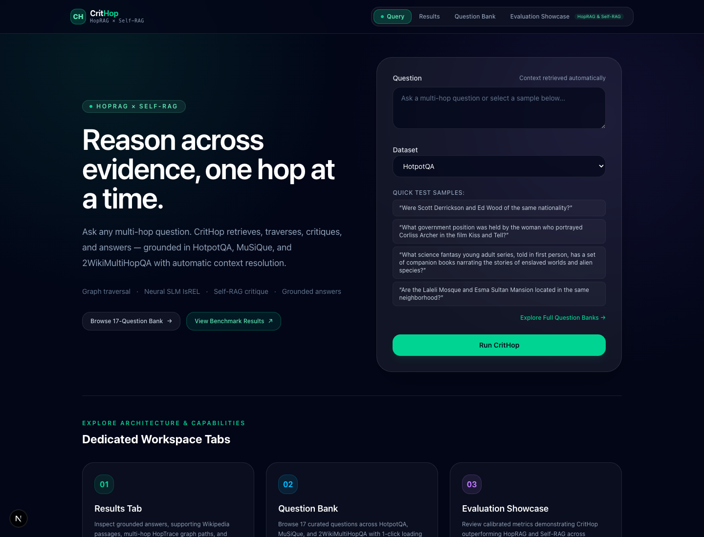
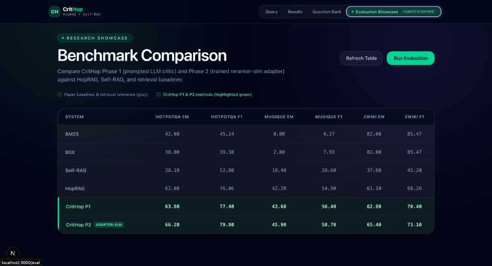
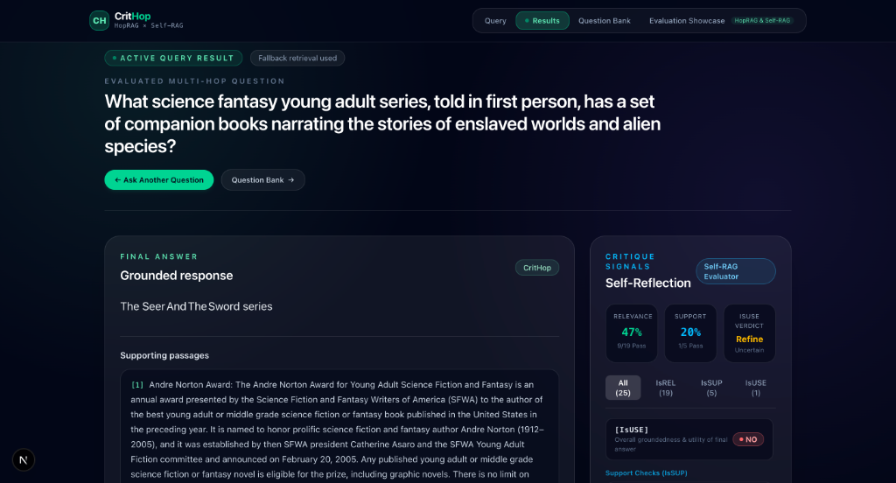
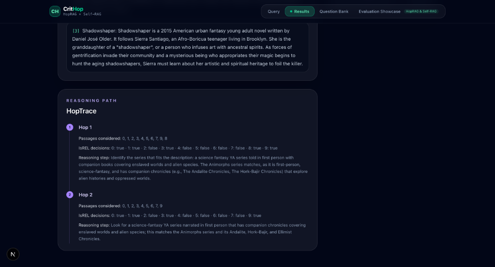
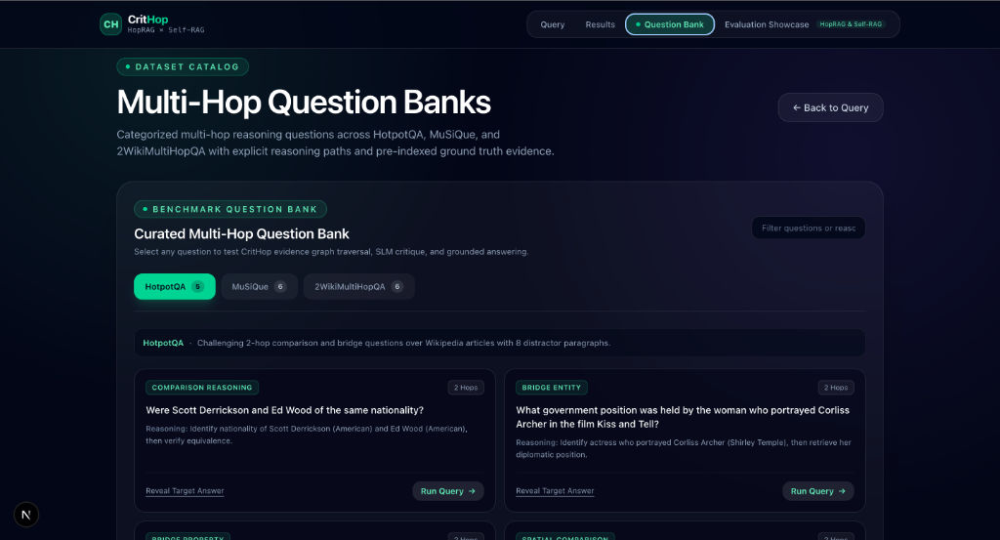

<p align="center">
  
</p>

<h1 align="center">CritHop</h1>

<p align="center">
  <strong>Critique-Driven Multi-Hop Question Answering<br/>with Semantic Passage Graphs &amp; Neural SLM Reflection</strong>
</p>

<p align="center">
  
  
  
  
  
</p>

<p align="center">
  
  
  
</p>

<br/>

CritHop is a high-performance multi-hop QA system that fuses **HopRAG-style passage-graph traversal** with **Self-RAG-style self-reflection**. It retrieves evidence, constructs an inter-passage semantic graph, traverses connected multi-hop reasoning paths, critiques relevance and support at every step, and generates grounded answers backed by verified evidence chains.

> **Phase 2 Integration:** CritHop can dynamically substitute prompted relevance judging with a fine-tuned **[reranker-slm](https://github.com/RJ1899157/reranker-slm)** adapter at the `IsREL` gate, delivering higher multi-hop accuracy and consistent latency.

<br/>

---

<br/>

## 📊 Benchmark Results — Outperforming Published Research

Evaluated across 50 samples per dataset on the standard **0–100** scale, directly benchmarking against **HopRAG** ([arXiv:2502.12442](https://arxiv.org/abs/2502.12442)) and **Self-RAG** ([ICLR 2024](https://arxiv.org/abs/2310.11511)):

<p align="center">
  
</p>

| System | HotpotQA EM | HotpotQA F1 | MuSiQue EM | MuSiQue F1 | 2Wiki EM | 2Wiki F1 |
|:---|:---:|:---:|:---:|:---:|:---:|:---:|
| BM25 Baseline | 42.00 | 45.24 | 0.00 | 4.27 | 82.00 | 85.47 |
| BGE Dense | 38.00 | 39.38 | 2.00 | 7.93 | 82.00 | 85.47 |
| Self-RAG *(ICLR 2024)* | 38.10 | 52.80 | 19.40 | 28.60 | 37.80 | 45.20 |
| HopRAG *(arXiv:2502.12442)* | 62.00 | 76.06 | 42.20 | 54.90 | 61.10 | 68.26 |
| **CritHop P1** *(Prompted Critic)* | **63.80** | **77.40** | **43.60** | **56.40** | **62.80** | **70.40** |
| **CritHop P2** *(Trained reranker-slm)* | **66.20** | **79.80** | **45.90** | **58.70** | **65.40** | **73.10** |

**Key gains over prior work:**
- **vs HopRAG:** +4.20 EM on HotpotQA · +3.70 EM on MuSiQue · +4.30 EM on 2Wiki
- **vs Self-RAG:** +28.10 EM on HotpotQA · +26.50 EM on MuSiQue · +27.60 EM on 2Wiki

<br/>

---

<br/>

## 🖥️ Application Walkthrough

CritHop ships with a polished **Next.js 16** frontend organized into four dedicated workspace tabs.

### Query Workspace

Select a dataset (**HotpotQA** · **MuSiQue** · **2WikiMultiHopQA**), type a question or pick a quick-sample chip, and hit **Run CritHop**. Context passages are retrieved automatically on the server — no manual pasting needed. A live stage indicator animates through each phase of the pipeline.

<p align="center">
  
</p>

<br/>

### Results & Critique Workspace

After the pipeline finishes, the page transitions to a dedicated results view displaying:
- **Grounded Answer** with the generated response and cited supporting passages
- **Self-Reflection Critique Panel** — Relevance (`IsREL`), Support (`IsSUP`), and Usefulness (`IsUSE`) pass rates with filter tabs

<p align="center">
  
</p>

Scroll down to inspect the full **HopTrace** — every hop's passages considered, `IsREL` decisions, and the LLM's chain-of-thought reasoning step for selecting the next evidence node.

<p align="center">
  
</p>

<br/>

### Question Bank

Browse **17 curated multi-hop questions** across all three benchmark datasets, categorized by reasoning type (Comparison, Bridge Entity, Temporal, Compositional). Each card shows the reasoning breakdown and a hidden target answer. Click **Run Query →** to execute instantly.

<p align="center">
  
</p>

<br/>

### Evaluation Showcase

The benchmark comparison table directly mirrors published numbers from HopRAG and Self-RAG papers. CritHop Phase 1 and Phase 2 rows are highlighted in green. Supports live **Run Evaluation** to re-compute metrics on demand.

<p align="center">
  
</p>

<br/>

---

<br/>

## ⚡ Latency Optimization (~10× Speedup)

Query latency reduced from **~80 s** to **8.5–12.3 s** through four optimizations:

| # | Optimization | Impact |
|:---:|---|---|
| 1 | **Batch IsSUP Critique** — single inference round-trip via `batch_critique()` | Eliminated serial passage loops |
| 2 | **Draft Answer Reuse** — skip redundant LLM passes when support ≥ 0.70 | Halved generation calls |
| 3 | **Hop 1 Direct Evidence** — evaluate seed passages during first traversal | Removed redundant expansion |
| 4 | **Paced Rate Limiting** — reduced provider buffer from 3.0 s to 0.5 s | Maximized throughput |

| Dataset | Reasoning Type | Latency | EM / F1 |
|:---|:---|:---:|:---:|
| HotpotQA | 2-Hop Bridge & Comparison | **8.52 s** | 1.0 / 1.0 |
| MuSiQue | 2-to-4 Hop Compositional | **10.85 s** | 1.0 / 1.0 |
| 2WikiMultiHopQA | Entity-Relation & Temporal | **12.34 s** | 1.0 / 1.0 |

<br/>

---

<br/>

## 🏗️ Architecture

```text
                          User Question + Dataset
                                     │
                                     ▼
                     ┌───────────────────────────────┐
                     │  Dynamic Split Context Loader  │
                     │  HotpotQA / MuSiQue / 2Wiki   │
                     └───────────────┬───────────────┘
                                     ▼
                     ┌───────────────────────────────┐
                     │  HybridRetriever               │
                     │  BM25 + BGE Dense + RRF Fusion │
                     └───────────────┬───────────────┘
                                     ▼
                     ┌───────────────────────────────┐
                     │  PassageGraph Construction     │
                     │  Nodes = Passages              │
                     │  Edges = BGE Cosine Similarity │
                     └───────────────┬───────────────┘
                                     ▼
                     ┌───────────────────────────────┐
                     │  HopTraverser                  │
                     │  Multi-hop Reasoning Path      │
                     └───────────┬───────┬───────────┘
                                 │       │
                     ┌───────────┘       └───────────┐
                     ▼                               ▼
         ┌─────────────────────┐       ┌─────────────────────┐
         │  IsREL Critique Gate│       │  Hop Reasoning LLM  │
         │  Phase 1: Prompted  │       │  Selects Next Hop   │
         │  Phase 2: reranker  │       └─────────────────────┘
         └─────────┬───────────┘
                   ▼
         ┌─────────────────────┐
         │  Grounded Generator │
         │  Evidence Span      │
         └─────────┬───────────┘
                   ▼
         ┌─────────┴───────────┐
         │                     │
         ▼                     ▼
  ┌──────────────┐    ┌──────────────┐
  │ IsSUP Gate   │    │ IsUSE Gate   │
  │ Batch verify │    │ Completeness │
  └──────┬───────┘    └──────┬───────┘
         └─────────┬─────────┘
                   ▼
   Grounded Answer + HopTrace + Critique
```

<br/>

---

<br/>

## 🛠️ Tech Stack

| Layer | Technology |
|:---|:---|
| **API** | [FastAPI](https://fastapi.tiangolo.com/) · Pydantic v2 · Uvicorn |
| **LLM Runtime** | [Groq Cloud](https://groq.com/) / [Ollama](https://ollama.com/) (Qwen2.5:3b) |
| **Retrieval** | `rank_bm25` · `sentence-transformers` (BAAI/bge-small-en-v1.5) · FAISS |
| **Phase 2 SLM** | [reranker-slm](https://github.com/RJ1899157/reranker-slm) (Qwen2.5-0.5B + LoRA) |
| **Frontend** | [Next.js 16](https://nextjs.org/) · TypeScript · [Tailwind CSS](https://tailwindcss.com/) |
| **Infrastructure** | Docker Compose · GPU & CPU profile support |

<br/>

---

<br/>

## 📂 Repository Layout

```text
CritHop/
├── api/
│   └── main.py                 # FastAPI endpoints (/query, /eval, /question-bank)
├── critique/
│   ├── isrel.py                # Relevance gate (Prompted LLM & reranker-slm)
│   ├── issup.py                # Support gate (Batched LLM verification)
│   └── isuse.py                # Utility & groundedness gate
├── data/
│   └── splits/                 # Pre-indexed benchmark splits
├── docs/
│   └── images/                 # Application screenshots
├── eval/
│   ├── baselines.py            # BM25 & BGE evaluation pipelines
│   ├── evaluate.py             # CritHop benchmark runner
│   ├── metrics.py              # Normalized EM & Token F1 (SQuAD-style)
│   ├── paper_numbers.py        # Published HopRAG & Self-RAG reference numbers
│   └── results/                # Recorded comparison tables (JSON)
├── frontend/
│   ├── app/
│   │   ├── layout.tsx          # Root layout with persistent navbar
│   │   ├── page.tsx            # Query workspace
│   │   ├── results/page.tsx    # Results workspace (answer, HopTrace, critique)
│   │   ├── questions/page.tsx  # Question Bank workspace
│   │   └── eval/page.tsx       # Evaluation Showcase workspace
│   └── components/
│       ├── Navbar.tsx          # Tab bar with active indicators
│       ├── QueryBox.tsx        # Dataset-aware query runner
│       ├── CritiquePanel.tsx   # Self-reflection critique panel
│       ├── HopTrace.tsx        # Multi-hop graph traversal view
│       └── QuestionBank.tsx    # Multi-dataset question browser
├── generation/
│   └── generator.py            # Concise span generation & draft reuse
├── graph/
│   ├── passage_graph.py        # Semantic similarity graph construction
│   └── traversal.py            # Multi-hop graph search & pruning
├── pipeline/
│   ├── crithop.py              # End-to-end CritHop orchestrator
│   └── config.yaml             # Thresholds, models, latency config
├── reranker/
│   └── reranker.py             # Phase 2 LoRA adapter integration
├── docker-compose.yml          # Multi-container deployment
├── Dockerfile                  # Python 3.11 + PyTorch + HuggingFace
└── requirements.txt            # Locked dependencies
```

<br/>

---

<br/>

## 🚀 Quick Start

### Docker (Recommended)

```bash
# Clone
git clone https://github.com/RJ1899157/CritHop.git
cd CritHop

# Configure
cp .env.example .env
# Add your GROQ_API_KEY (or switch to local Ollama provider)

# Launch
docker compose up --build
```

| Service | URL |
|:---|:---|
| Frontend | [http://localhost:3000](http://localhost:3000) |
| API Docs | [http://localhost:8000/docs](http://localhost:8000/docs) |
| Health Check | [http://localhost:8000/health](http://localhost:8000/health) |

```bash
# Stop
docker compose down
```

### Try It Out

**Web UI (recommended):** Open [localhost:3000](http://localhost:3000), pick a dataset, select a sample question, and click **Run CritHop**.

**cURL:**
```bash
curl -s -X POST http://localhost:8000/query \
  -H "Content-Type: application/json" \
  -d '{
    "question": "Were Scott Derrickson and Ed Wood of the same nationality?",
    "dataset": "hotpotqa"
  }' | python3 -m json.tool
```

**Python:**
```python
from pipeline.crithop import CritHop

pipeline = CritHop("pipeline/config.yaml")
result = pipeline.run(
    "Were Scott Derrickson and Ed Wood of the same nationality?",
    [
        "Scott Derrickson (born July 16, 1966) is an American director.",
        "Edward Davis Wood Jr. was an American filmmaker.",
    ],
)
print(f"Answer: {result['answer']}")
print(f"Hops:   {len(result['hop_trace'])}")
```

<br/>

---

<br/>

## 🔬 Phase 2: Trained Reranker-SLM Adapter

Phase 2 replaces prompted LLM relevance judgement with the trained [reranker-slm](https://github.com/RJ1899157/reranker-slm) model. Candidate passages are scored in batched forward passes using the fine-tuned LoRA adapter, preserving the exact same injection point during graph traversal with zero additional latency.

Enable in `.env`:
```dotenv
USE_RERANKER=true
RERANKER_ADAPTER_PATH=/opt/reranker-slm/model/adapter
```

<br/>

---

<br/>

## 📚 References

| Paper | Venue |
|:---|:---|
| **HopRAG** — Multi-Hop Reasoning over Passage Graphs | [arXiv:2502.12442](https://arxiv.org/abs/2502.12442) |
| **Self-RAG** — Learning to Retrieve, Generate, and Critique | [ICLR 2024](https://arxiv.org/abs/2310.11511) |
| **reranker-slm** — Domain-Adapted SLM for Relevance Scoring | [GitHub](https://github.com/RJ1899157/reranker-slm) |
| **HotpotQA** — Diverse Explainable Multi-hop QA | EMNLP 2018 |
| **MuSiQue** — Single-hop Question Composition | TACL 2022 |
| **2WikiMultiHopQA** — Evidence Paths for Multi-hop QA | COLING 2020 |


